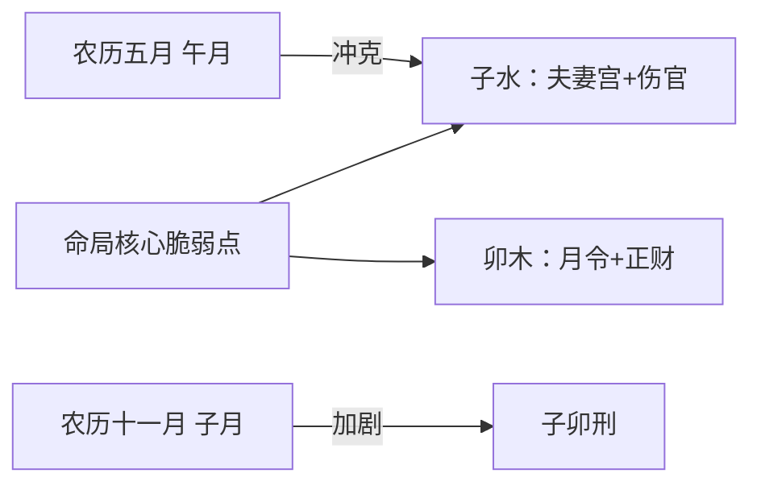

# 2026丙午年的挑战与应对

## 为什么2026丙午年是压力之年

从命理角度看，2026丙午年对命主而言是一个压力和挑战较大的年份。这背后的原因需要从天干地支的互动来理解：

- **天干丙火七杀再现**：七杀代表事业压力、激烈竞争乃至是非官非
- **地支午火为官杀旺地**：火上加火，克身太过
- **午火冲日支子水夫妻宫**：直接冲击情感根基
- **午火与年支亥水暗合**：火势炎炎，形成"火克金"的局面

> [!info] 七杀是什么
> 七杀是八字十神之一，代表压力、挑战、权威人物。当七杀力量过旺而日主无法承受时，往往感到身心俱疲、压力重重。

## 固有压力测试点：农历五月与十一月

命局中存在两个"固有压力测试点"——**农历五月**和**农历十一月**。这不是巧合，而是命局结构的必然结果：



- **农历五月**：午火冲克子水（夫妻宫）
- **农历十一月**：子水加剧原有的子卯刑

但这只是"背景噪音"，真正决定能量音量大小的，是**流年**这个旋钮。

## 2025 vs 2026：从冲击波到地震

回顾2025年，这两个月份确实给命主带来了重创：

| 时间 | 事件 |
|------|------|
| 农历五月底 | 女方态度坚决，要分手，命主苦苦挽留 |
| 农历十一月初 | 正式分手 |

而到了2026年，挑战的**强度**和**性质**都将升级：

> [!warning] 2025是"冲击波"，2026是"地震"
> 2026年的能量烈度与影响深度，将远超2025年同期。这是因为流年丙午，午火直接正冲夫妻宫子水，七杀力量达到顶峰。

## 2026丙午年的特殊阵痛

2026年是**换大运的启动年**，又逢"子午冲"这一剧烈变动之象。这是新旧十年周期交替的"阵痛高峰"。

### 农历五月（午月）：岁运并临

```
流年午 + 流月午 = 双午并临
         ↓
    强力冲子（夫妻宫）
         ↓
全年冲击力最高峰
```

**主要效应**：
- 心脏、心血管系统压力增大
- 情绪如沸水，易冲动决策
- 睡眠障碍
- 易引发意外（摔伤、烫伤）

**核心建议**：务必"养心"。借助静坐、冥想、午休来平衡，重要决定延后，避免激烈运动。

### 农历十一月（子月）：三子汇水

```
大运亥 + 流月子 + 命局子 = 水势激增
         ↓
    水旺木漂
         ↓
伤官心性失控
```

**主要效应**：
- 子卯刑彻底激活，口舌是非激增
- 内心纠结、翻旧账
- 言辞带刺，易误解他人
- 寒湿之气影响健康（关节、泌尿）

**核心建议**：务必"守口"。有情绪时先写下而非说出口，多晒太阳补火调候，注意保暖。

## 应对策略：避让与转化

### 具体避让措施

在这两个月份，应避免：
- 感情、合作、投资的重大决定
- 高强度社交与辩论
- 行车安全与身体炎症（火克金，注意呼吸系统、上火）

### 积极转化方案

将"冲"的能量引导向积极方向：

| 转化方式 | 作用 |
|---------|------|
| 体育锻炼 | 释放火金压力 |
| 整理家居 | 处理旧物，应"冲"象 |
| 学习静坐 | 安顿子水，平衡情绪 |
| 远行 | 应"冲"的变动之象 |

## 子午冲的深层影响

一个常见的困惑是：**没有女朋友了，夫妻宫被冲还有什么影响？**

> [!quote] 夫妻宫的三层含义
> 1. 伴侣关系（外在）
> 2. 内心对亲密关系的渴求与认知模式（内在）
> 3. 情绪根基与安全感来源（核心）

即使没有外在的"妻"，内在的"夫妻宫"——即情感模式、情绪稳定性和对亲密关系的认知——也会经历剧烈震荡：

- 对过去感情的反复纠结与懊悔（伤官水被激发）
- 因孤独感或对比而产生的情绪焦躁（午火克金）
- 在人际关系中易不耐烦或产生误解（引发口舌）

## 能量转换的智慧

命理不仅是预警，更是转化的指南。2026丙午年的挑战固然严峻，但也是深刻的自我认知和人生方向抉择的契机。

通过理解这些能量的运作规律，我们可以：
- **主动避让**：在高风险月份降低风险行为
- **顺势转化**：将破坏力转化为破旧立新的行动力
- **深度觉察**：在震荡中看清自己的情感模式和核心课题

---

**相关文章**：[[大运流年与夫妻宫命理]] | [[节气与月令基础知识]]
