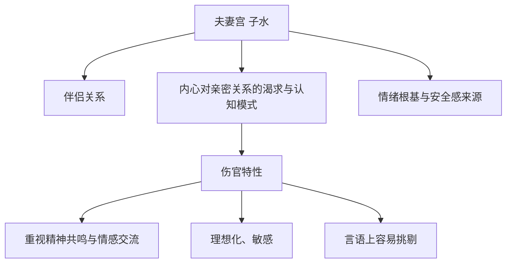

# 大运流年与夫妻宫命理

## 2026年的大运与流年

2026年命主进入一个新的十年周期：

```yaml
大运: 乙亥
流年: 丙午
```

这是一个重要的转折点。乙亥大运的到来，标志着运势的上扬，渐入佳境。但流年丙午的七杀攻身，使得这一年成为**换大运的适应期**，需要稳守。

## 夫妻宫的三重含义

夫妻宫（日支）在命理中远不止代表"配偶"这个人，它是一个深刻的符号系统：



当夫妻宫被冲时，即使没有外在的伴侣关系，这三个层面都会经历震荡。

## 子卯刑：情感模式的深层课题

命局的核心课题之一是"子卯刑"，具体表现为**情感中的完美主义与言语摩擦**。

### 结构分析

```
月柱卯木（正财妻星）
    ↓
与夫妻宫子水形成"子卯相刑"
    ↓
情感模式的深层课题
```

这个结构揭示了：
- 容易因细节、言语或期望值错位而产生摩擦
- 可能"好心办坏事"，造成误会
- 亲密关系中需要特别注意情绪管理

> [!tip] 理解子卯刑
> 子刑卯，本质上是无礼之刑。子水（鼠）与卯木（兔）之间存在一种特殊的紧张关系，在情感层面表现为"想要亲近却总是产生摩擦"的悖论。

## 2026丙午年：天干地支的双重影响

### 天干：丙火七杀

流年天干丙火为七杀，与大运天干乙木相生，火势更旺：

- **七杀**：代表事业压力、激烈竞争、是非官非
- **财生杀**：大运乙木（财）生流年丙火（七杀），压力倍增

### 地支：午火冲子水

流年地支午火与日支子水形成"子午相冲"：

- **水火冲**：直接冲动夫妻宫与子女宫
- **生活环境变动**：可能涉及居住、工作环境的变化
- **人际关系紧张**：尤其是配偶或合作伙伴关系
- **内心情绪剧烈波动**：子水受冲，影响睡眠（水主肾、泌尿系统）

## 2027丁未年：官印相生的转机

与2026年的低谷期形成鲜明对比，2027丁未年运势明显提升：

### 天干：丁火正官

```yaml
丁火正官 + 乙木正财 = 财生官
    ↓
官来合我（丁火合绊时干壬水）
    ↓
事业新机会、职位或合作
```

### 地支：未土正印

```yaml
未土正印 + 财库 + 卯未半合
    ↓
财官印相生
    ↓
事业财运实质性好转
```

> [!success] 2027年吸引良缘的根基
> 2027年官印相生，财库打开，事业与财运将有实质性好转。**个人的稳定与自信**，才是吸引良缘的真正基石。

## 乙亥大运：运势上扬的内在逻辑

为什么进入乙亥大运后会运势上扬、渐入佳境？

```
亥水食神
    ↓
泄秀生财
    ↓
缓和七杀压力
    ↓
转压力为生财动力
```

这是一个能量转化的美妙机制：食神（才华、表达）不仅能生财，还能制杀（亥中壬水制丙火）。

## 情绪疏解的艺术

2026丙午年的能量挑战需要主动的情绪管理：

### 疏解方向

| 方向 | 作用 | 举例 |
|------|------|------|
| 运动 | 释放火金压力 | 跑步、游泳、球类运动 |
| 学习 | 土金属性 | 金融、AI技术、管理 |
| 远行 | 应"冲"的变动之象 | 旅行、出差、探索新环境 |

### 具体建议

> [!quote] 允许自己悲伤，但不要过度自责或反刍
> 将精力投向运动、学习或远行，以疏解情绪。把2026年当作一个深度学习、积累、谨慎行事的年份，为2027年的机会做好准备。

## 子午冲的长期影响

丙火七杀透干，地支午火正冲夫妻宫子水，这股冲的力量将**持续整个2026年**，尤其是夏季火旺之时。

具体表现可能包括：
- 反复回想、分析这段关系
- 情绪仍有较大波动
- 影响睡眠（子水受冲，水主肾、泌尿系统）

但大运亥水与年支亥水伏吟，也暗示了深刻的成长：

> [!light] 更深刻地理解"关系"的本质
> 旧的感情模式（子卯刑）虽曾带来伤痛，但这段经历将帮助你学会以更成熟、从容的方式（食神特性）去面对未来。

## 命理的核心智慧

命理不是宿命论，而是**能量地图**。理解大运流年与夫妻宫的运作规律，让我们能够：

- **预知挑战**：在高风险时期保持警觉
- **把握机会**：在运势上行时积极进取
- **转化能量**：将压力转化为成长的动力
- **深化觉察**：在震荡中看清自己的核心课题

2026年是阵痛，也是契机；2027年是转机，也是收获。理解这个节奏，就能在命运的浪潮中游刃有余。

---

**相关文章**：[[2026丙午年的挑战与应对]] | [[节气与月令基础知识]]
