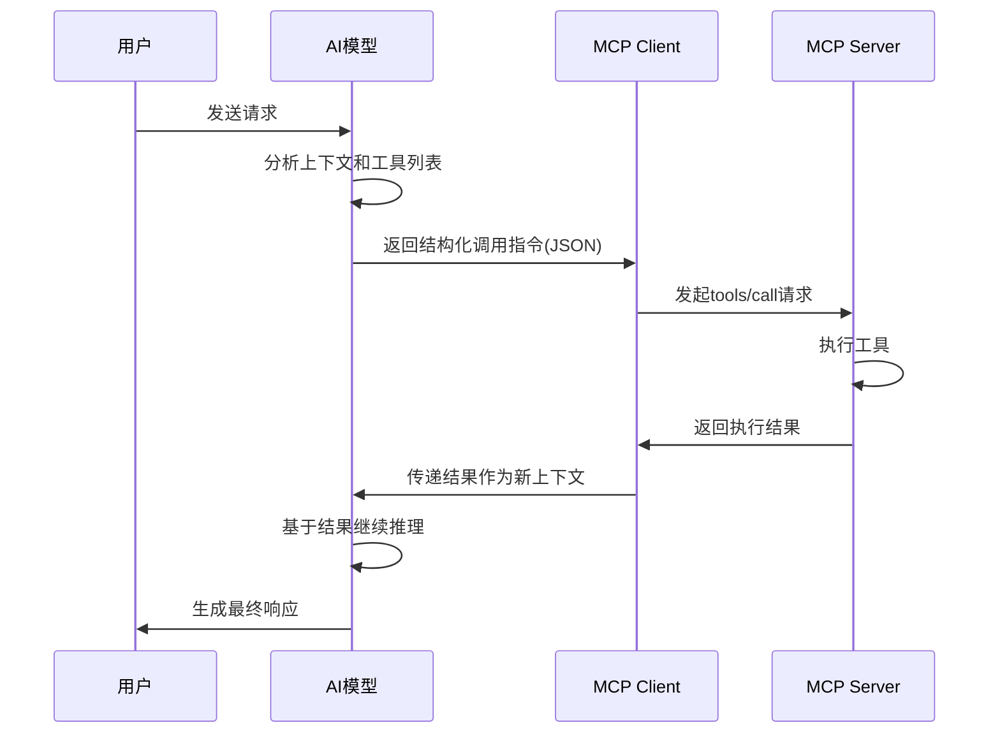

# MCP工作流程详解

## MCP完整调用流程

MCP的工作流程体现了AI模型、客户端和服务端的精妙协作。整个过程可以分为初始化和动态调用两个阶段。

### 初始化阶段：工具注册与发现

在用户发送请求前，系统需要完成工具的注册和发现：

1. **MCP Client启动并连接MCP Server**
   - Client与Server建立连接
   - 准备进行工具信息交换

2. **获取可用工具列表**
   - Client通过`list_tools`接口获取Server暴露的所有工具定义
   - 这些定义包括工具名称、schema、元数据等完整信息

3. **工具定义注入LLM上下文**
   - Client将获取的工具列表发送给LLM
   - LLM根据这些信息构造prompt/context，了解当前环境中有哪些工具可以调用

> [!tip] "注册"的含义
> MCP Server将其tools/resources/prompts暴露出来，附带元数据和schema，这个过程称为"注册"。注册后，LLM就知道可以使用哪些MCP工具了。

### 动态调用阶段：从决策到执行

当用户发出请求时，MCP开始真正的工具调用流程：

### 详细步骤解析

1. **LLM决策阶段**
   - LLM根据上下文判断是否需要调用工具
   - 输出结构化调用意图（JSON格式，指定工具名和参数）
   - LLM只负责决策，不执行代码

2. **Client转发阶段**
   - Client接收LLM的JSON调用指令
   - 向对应的MCP Server发起`tools/call`请求
   - Client起到桥梁作用，不进行推理

3. **Server执行阶段**
   - Server接收调用请求，执行具体工具
   - 将执行结果以结构化格式返回给Client

4. **结果反馈阶段**
   - Client将Server返回的结果传给LLM作为新上下文
   - LLM基于此继续推理生成最终响应

## 核心协作机制

### Client与LLM、Server的关系

- **Client与LLM**：Client接收LLM的JSON调用指令
- **Client与Server**：Client向Server发起tools/call请求

Client在中间起到适配和转换的作用，确保两个不同系统能够顺畅通信。

### "LLM负责决策"的深层含义

"LLM负责决策"意味着：
- LLM根据上下文判断何时需要调用工具
- LLM决定调用哪个工具
- LLM确定调用参数
- LLM不直接执行代码或访问系统资源

## 关键设计原理

### 为什么LLM无法直接调用外部功能

LLM无法直接调用外部功能和API的根本原因是：**LLM只能生成文本**。它没有执行代码、访问系统资源或发起网络请求的能力。所有的外部交互都需要通过Client这样的中介来完成。

### MCP Server的被动性

MCP Server不能自己决定何时运行工具，因为：
- 它只是工具提供者
- 不负责业务逻辑决策
- 需要等待Client的调用请求

## 架构优势

这种精心设计的工作流程带来了几个重要优势：

1. **清晰的职责划分**：LLM专注决策，Server专注执行，Client专注通信
2. **灵活的扩展性**：可以轻松添加新的Server和工具
3. **统一的调用接口**：所有工具都通过相同的协议调用
4. **安全隔离**：LLM无法直接访问系统资源，降低了安全风险

## 相关概念

- [[MCP基础概念与架构]]：了解MCP的基本组件
- [[AI Agent架构设计]]：深入理解Agent的完整架构
- [[进程间通信机制]]：了解Client与Server之间的通信原理

## 总结

MCP的工作流程体现了"各司其职"的设计哲学。通过初始化阶段的工具发现和动态调用阶段的精确协作，MCP实现了AI模型与外部工具的无缝集成。理解这个流程对于开发基于MCP的应用至关重要。