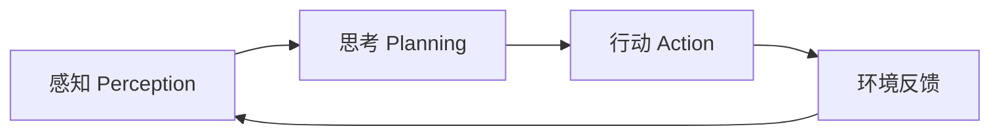

# AI Agent架构设计

## Agent核心组件剖析

AI Agent是一个复杂的系统，由多个独立但协作的组件组成。理解这些组件的职责和相互关系，是构建高效Agent系统的关键。

### 核心组件分类

一个完整的Agent框架包含以下四个独立部分：
1. **Memory（记忆）**：存储和管理信息
2. **Model（模型）**：负责推理和决策
3. **Tools（工具）**：执行具体动作
4. **Environment（环境）**：提供执行上下文

> [!tip] 组件职责清晰划分
> 在Agent设计中，每个组件都有明确的职责。Model负责推理，Tools负责动作执行，Memory负责存储，Environment负责提供状态反馈。

## Agent的两大独立部分

### AI推理模块（Model Caller）

AI推理模块本质上是调用外部大模型的接口，它具有以下特点：
- **不执行代码**：只产生决策和意图
- **不访问系统资源**：专注于逻辑推理
- **相当于大脑**：决定做什么而不是怎么做

```python
# AI推理模块的典型实现
class ModelCaller:
    def __init__(self, model_name):
        self.model = get_model(model_name)

    def think(self, context, tools_available):
        # 根据上下文和可用工具做出决策
        decision = self.model.generate(context, tools_available)
        return decision
```

### MCP Client（工具调用与执行模块）

MCP Client是Agent的"手脚"，负责：
- **接收执行指令**：从推理模块获取结构化命令
- **调用外部工具**：与各种服务交互
- **处理执行结果**：将结果返回给推理模块

## Agent核心循环

### 感知-思考-行动循环（P-A-C循环）



1. **感知（Perception）**：读取Environment返回的output，了解当前状态
2. **思考（Planning）**：LLM分析情况，生成下一步行动指令
3. **行动（Action）**：Environment.execute()执行具体动作
4. **环境反馈**：获取行动结果，更新状态，开始新一轮循环

### 在mini-swe-agent中的体现

mini-swe-agent的实现很好地诠释了这个循环：
- **感知**：读取命令执行结果
- **思考**：LLM生成bash命令
- **行动**：Environment执行命令
- **环境**：LocalEnvironment/DockerEnvironment提供执行环境

### 通用Agent框架的完整循环

更完整的Agent框架还包括规划和记忆：

1. **构建Prompt**：整合系统提示、任务描述、历史记录、可用工具
2. **调用Model**：获取AI的决策
3. **解析动作**：提取具体的执行指令
4. **执行动作**：通过Tools或Environment执行
5. **更新记忆**：存储执行结果和新状态
6. **检查完成**：判断是否达成目标

## Memory系统设计

### 三种记忆类型

1. **短期记忆**（Working Memory）
   - 当前消息列表
   - 保存最近对话历史
   - 用于理解当前上下文

2. **长期记忆**（Long-term Memory）
   - 向量数据库存储的知识
   - 可检索的历史经验
   - 用于解决复杂问题

3. **工作记忆**（Task State）
   - 当前任务的状态信息
   - 中间结果和变量
   - 用于追踪任务进度

### mini-swe-agent的简单实现

mini-swe-agent采用了最简单的Memory实现：
```python
class SimpleMemory:
    def __init__(self):
        self.messages = []  # 简单的消息列表
```

虽然简单，但对于大多数任务已经足够。

## 特殊设计模式

### mini-swe-agent的隐式工具设计

mini-swe-agent有一个特殊的设计：没有显式的Tools组件。这是因为：
- 它只有一个隐式工具：**bash命令**
- 所有能力都通过bash实现
- 简化了架构，但保持了强大的扩展性

> [!warning] 设计权衡
- 优点：架构简单，统一接口
- 缺点：所有功能都需要通过命令行包装

### Environment的多重身份

在不同的框架中，Environment有不同的称呼：
- **mini-swe-agent**：Environment
- **LangChain**：Tool/Executor
- **通用框架**：执行环境或工具集

## 最简Agent框架设计

一个最基础的Agent框架只需要两个核心组件：

```python
class MinimalAgent:
    def __init__(self, model, environment):
        self.model = model        # LLM调用部分
        self.env = environment     # 执行部分

    def run(self, task):
        context = task
        while not self.is_done(context):
            # 思考
            action = self.model.decide(context)
            # 行动
            result = self.env.execute(action)
            # 更新上下文
            context += f"\nAction: {action}\nResult: {result}"
```

## 架构演进路径

### 从简单到复杂

1. **Level 1**：Model + Environment（最简架构）
2. **Level 2**：+ Memory（增加记忆能力）
3. **Level 3**：+ Tools（丰富工具生态）
4. **Level 4**：+ Planning（增加规划能力）
5. **Level 5**：+ Learning（增加学习机制）

### MCP在Agent架构中的位置

MCP主要影响Tools层：
- 提供标准化的工具接口
- 支持分布式工具部署
- 简化工具集成和管理

## 相关概念

- [[MCP基础概念与架构]]：了解MCP如何支持Agent的工具层
- [[MCP工作流程详解]]：深入理解MCP在Agent中的调用流程
- [[mini-swe-agent深度解析]]：看看具体实现案例

## 总结

AI Agent的架构设计体现了模块化和职责分离的原则。通过清晰的组件划分和标准化的接口，可以构建出灵活、可扩展的智能系统。理解这些设计原则，对于开发自己的Agent系统非常有帮助。