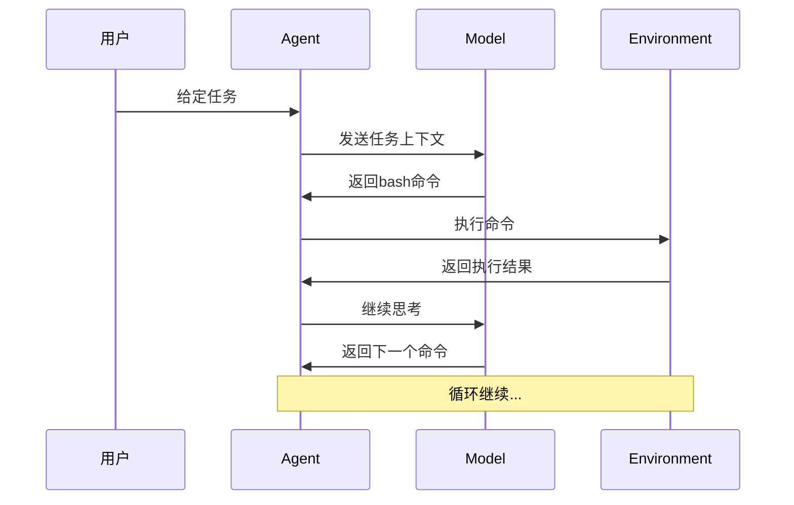

# mini-swe-agent深度解析

## 项目概述

mini-swe-agent是一个简洁而强大的AI Agent实现，专注于通过bash命令解决软件工程任务。它的设计体现了"大道至简"的理念，通过最少的组件实现了完整的Agent循环。

## 核心架构

### 两大主要部分

mini-swe-agent由两个核心组件构成：

1. **Model（LLM调用部分）**
   - 负责与AI模型交互
   - 生成决策和命令
   - 封装在`models/litellm_model.py`中

2. **Environment（执行部分）**
   - 负责执行bash命令
   - 管理系统交互
   - 实现在`environments/local.py`中

### 极简设计哲学

mini-swe-agent的一个显著特点是无状态shell会话：
- 每个命令都是独立执行的
- 不保持shell状态
- 通过`subprocess.run`直接执行

```bash
# 典型的执行示例
ls -la                # 独立执行
cd /tmp              # 状态不保留
ls                   # 仍在原目录
```

## 工作流程详解

### 完整执行循环



### 从Prompt构建到任务完成

1. **Prompt构建**
   - 系统提示词
   - 任务描述
   - 历史记录
   - 当前状态

2. **LLM调用**
   - 发送构造好的prompt
   - 获取AI响应
   - 解析bash命令

3. **执行命令**
   - Environment执行
   - 捕获输出
   - 处理错误

4. **反馈循环**
   - 结果加入上下文
   - LLM继续推理
   - 直到任务完成

## 核心文件解析

### agents/default.py - Agent循环核心

这是整个项目的灵魂文件（仅131行代码），实现了Agent的核心循环逻辑：

```python
class SimpleAgent:
    def run(self, task):
        self.messages = [{"role": "user", "content": task}]

        while not self.is_done():
            # 构建prompt
            prompt = self.build_prompt()

            # 调用LLM
            response = self.model.generate(prompt)

            # 解析并执行命令
            command = self.parse_command(response)
            result = self.env.execute(command)

            # 更新消息历史
            self.messages.append({
                "role": "assistant",
                "content": response
            })
            self.messages.append({
                "role": "system",
                "content": f"Command output: {result}"
            })
```

### environments/local.py - 执行环境

提供极简但完整的执行环境实现：

```python
class LocalEnvironment:
    def __init__(self):
        self.working_dir = os.getcwd()

    def execute(self, command):
        """执行命令并返回结果"""
        try:
            result = subprocess.run(
                command,
                shell=True,
                capture_output=True,
                text=True,
                cwd=self.working_dir
            )
            return {
                "output": result.stdout,
                "error": result.stderr,
                "return_code": result.returncode
            }
        except Exception as e:
            return {"error": str(e), "return_code": -1}

    def get_template_vars(self):
        """提供模板变量"""
        return {"working_dir": self.working_dir}
```

### models/litellm_model.py - LLM调用封装

使用LiteLLM库统一不同LLM的调用接口：

```python
from litellm import completion

class LiteLLMModel:
    def __init__(self, model_name):
        self.model_name = model_name

    def generate(self, messages):
        response = completion(
            model=self.model_name,
            messages=messages,
            temperature=0.1
        )
        return response.choices[0].message.content
```

## 学习价值

### 为什么mini-swe-agent是学习Agent的绝佳材料

1. **代码量小**：核心逻辑只有几百行
2. **结构清晰**：职责分离明确
3. **功能完整**：包含Agent的所有基本要素
4. **易于理解**：没有过度抽象

> [!tip] 学习路径
要理解AI Agent核心原理，只需读懂`agents/default.py`这一份文件即可。它展示了Agent循环的本质实现。

## 执行环境类型

mini-swe-agent支持多种执行环境：

1. **LocalEnvironment**：本机直接执行
   - 最简单直接
   - 适合开发调试

2. **DockerEnvironment**：容器中执行
   - 沙箱隔离
   - 安全可控

3. **SingularityEnvironment**：HPC集群执行
   - 超算环境
   - 大规模任务

## 关键设计决策

### 只执行bash命令的含义

mini-swe-agent将所有任务都交给命令行处理，这意味着：
- 任何功能都需要有对应的命令行工具
- 通过管道和组合可以实现复杂操作
- 保持了接口的统一性

### Memory的极简实现

```python
# mini-swe-agent的记忆实现
self.messages = []  # 简单列表
```

这种设计：
- 足够应对大多数场景
- 易于理解和调试
- 可根据需要扩展

## 扩展性分析

### 如何集成MCP工具

由于mini-swe-agent只执行bash命令，集成MCP工具需要将其包装成命令行程序：

```bash
# MCP工具包装示例
python amd-tool.py query '{"topic":"HIP"}'
```

### 潜在的改进方向

1. **增加状态管理**：支持shell状态保持
2. **添加工具管理**：内置常用工具集合
3. **优化提示工程**：更好的prompt模板
4. **增强错误处理**：更智能的恢复机制

## 与其他框架的对比

| 特性 | mini-swe-agent | LangChain | AutoGPT |
|------|----------------|-----------|---------|
| 复杂度 | 极简 | 中等 | 复杂 |
| 灵活性 | 高 | 中 | 低 |
| 学习曲线 | 平缓 | 陡峭 | 陡峭 |
| 扩展性 | 好 | 极好 | 中等 |

## 相关概念

- [[AI Agent架构设计]]：理解Agent的整体设计原理
- [[MCP集成实现方案]]：了解如何在mini-swe-agent中集成MCP
- [[CLI程序开发实践]]：学习如何为MCP工具创建CLI包装器

## 总结

mini-swe-agent通过极简的设计展示了Agent的核心本质。它证明了复杂的智能行为可以通过简单的组件和清晰的架构来实现。对于想要深入理解AI Agent原理的开发者来说，这是一个完美的学习案例。