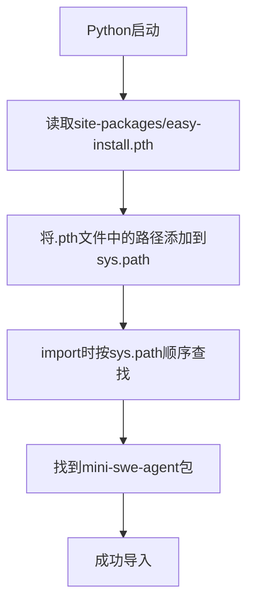

# CLI命令与包管理：mini-swe-agent的使用与分发

mini-swe-agent通过精心设计的CLI界面和包管理机制，为用户提供了便捷的使用体验。理解这些机制不仅有助于使用该工具，更能让我们深入理解Python包的分发和命令行工具的开发实践。

## pip install -e .的魔力

### 可编辑安装的本质

`pip install -e .`（editable install）是Python包管理中的一个重要概念。与普通安装相比：

```bash
# 普通安装
pip install .          # 复制代码到 site-packages/

# 可编辑安装
pip install -e .       # 创建链接指向源代码
```

### 两种安装方式的核心区别

| 特性 | 普通安装 | 可编辑安装 |
|------|----------|------------|
| **存储方式** | 复制到site-packages | 创建软链接 |
| **代码位置** | <python>/site-packages/ | 原始开发目录 |
| **修改生效** | 需要重新安装 | 立即生效 |
| **移动限制** | 无限制 | 不能移动源码目录 |

### 为什么叫"editable"

因为安装后：
- 不是把代码复制到site-packages
- 而是创建一个"链接"指向原始源代码
- 修改源码后无需重新安装即可生效

> [!tip] 开发最佳实践
> 开发阶段使用`pip install -e .`，可以：
- 立即看到代码修改的效果
- 避免重复安装的繁琐过程
- 便于调试和测试

## Python包的查找机制

### sys.path的作用

Python启动时会读取`sys.path`，这个列表决定了import时的搜索路径：

```python
import sys
print(sys.path)
# 输出类似：
# ['/usr/lib/python39.zip', '/usr/lib/python3.9',
#  '/usr/lib/python3.9/lib-dynload',
#  '/home/user/.local/lib/python3.9/site-packages',
#  '/home/user/projects/mini-swe-agent/src']  # <- -e安装添加的路径
```

### 完整的导入流程



## CLI命令的注册机制

### pyproject.toml的配置

mini-swe-agent通过`pyproject.toml`定义CLI入口点：

```toml
[project.scripts]
mini = "minisweagent.run.mini:app"
```

这个配置告诉Python：
- 创建一个名为`mini`的可执行文件
- 该文件执行`minisweagent.run.mini`模块的`app`函数

### CLI命令的生成过程

```bash
pip install -e .
# 执行后：
# 1. 在 <python_env>/bin/ 创建 mini 文件
# 2. <python_env>/bin/ 在系统PATH中
# 3. 任意位置都可以直接输入 "mini"
```

### 为什么mini可以在任意位置运行

1. **可执行文件创建**：在Python环境的bin目录创建`mini`
2. **PATH环境变量**：bin目录在系统PATH中
3. **全局可访问**：任何位置都可以调用`mini`命令

## CLI参数的设计与使用

### 参数独立性原则

mini-swe-agent使用typer库构建CLI，所有参数都是独立的，可以自由组合：

```bash
mini --mcp -d -t "任务内容" -c config.yaml -o output.txt
```

### 核心参数详解

| 参数 | 全称 | 作用 | 可组合性 |
|------|------|------|----------|
| `-t` | `--task` | 直接传递任务内容 | ✅ |
| `-y` | `--yolo` | 免确认模式（自动执行） | ✅ |
| `-c` | `--config` | 指定配置文件路径 | ✅ |
| `-o` | `--output` | 指定输出文件 | ✅ |
| `-d` | `--debug` | 开启调试模式 | ✅ |
| `-v` | `--verbose` | 使用TUI界面 | ✅（与默认互斥） |

### 交互模式 vs 自动模式

```bash
# 默认模式（需要确认）
mini
# LLM输出 → 等待回车 → 执行 → 继续下一步

# YOLO模式（自动执行）
mini -y
# LLM输出 → 直接执行 → 继续下一步
```

### 不同Agent类型的启动

```bash
mini          # InteractiveAgent（简单命令行）
mini -v       # TextualAgent（TUI界面）
```

## 参数的执行顺序

当使用多个参数时，执行遵循特定的逻辑顺序：

```bash
mini --mcp -d -t "帮我查询HIP编程" -c custom.yaml
```

执行流程：
1. **配置加载**：读取`-c`指定的配置文件
2. **任务处理**：检查`-t`，决定是否交互式输入
3. **环境选择**：`--mcp`参数决定使用MCP环境
4. **调试设置**：`-d`参数决定使用调试版本
5. **Agent创建**：基于以上设置创建agent
6. **任务执行**：运行指定任务

## 多轮调用的来源

mini-swe-agent的多轮调用能力来源于两个层面：

### 1. 代码层面：Agent循环
```python
while True:
    # 执行直到触发 TerminatingException
```

### 2. 指导层面：Prompt Workflow
Prompt中定义的工作流程指导Agent进行多轮交互。

这种双层设计保证了多轮对话的稳定性和可控性。

## 包管理的最佳实践

### 开发环境设置

```bash
# 克隆项目
git clone https://github.com/mini-swe-agent/mini-swe-agent.git
cd mini-swe-agent

# 可编辑安装
pip install -e .

# 验证安装
mini --version
```

### 环境隔离

使用虚拟环境避免包冲突：

```bash
# 创建虚拟环境
python -m venv venv

# 激活环境
source venv/bin/activate  # Linux/Mac
# 或
venv\Scripts\activate     # Windows

# 安装包
pip install -e .
```

## 与其他系统的集成

### Environment方案的参数组合

`--mcp`参数与其他参数的组合使用：

```bash
# 基础MCP模式
mini --mcp

# MCP + 调试模式
mini --mcp -d

# 完整参数组合
mini --mcp -d -t "任务" -c config.yaml -y
```

每种组合都会触发不同的代码路径，但核心逻辑保持一致。

## 故障排除

### 常见问题

1. **命令未找到**
   ```bash
   # 检查安装
   pip show mini-swe-agent

   # 重新安装
   pip install -e .
   ```

2. **权限错误**
   ```bash
   # 使用用户安装
   pip install -e . --user
   ```

3. **版本冲突**
   ```bash
   # 创建新的虚拟环境
   python -m venv fresh_env
   source fresh_env/bin/activate
   pip install -e .
   ```

## 总结

mini-swe-agent的CLI和包管理机制体现了现代Python项目的最佳实践：

1. **使用pyproject.toml**：现代化的项目配置
2. **支持可编辑安装**：便于开发调试
3. **灵活的参数设计**：支持多种使用场景
4. **清晰的入口定义**：易于理解和扩展
5. **良好的文档**：帮助用户快速上手

这些设计选择让mini-swe-agent既易于开发维护，又方便用户使用，是开源项目的优秀范例。通过理解这些机制，我们可以更好地使用该工具，并将其设计思想应用到自己的项目中。