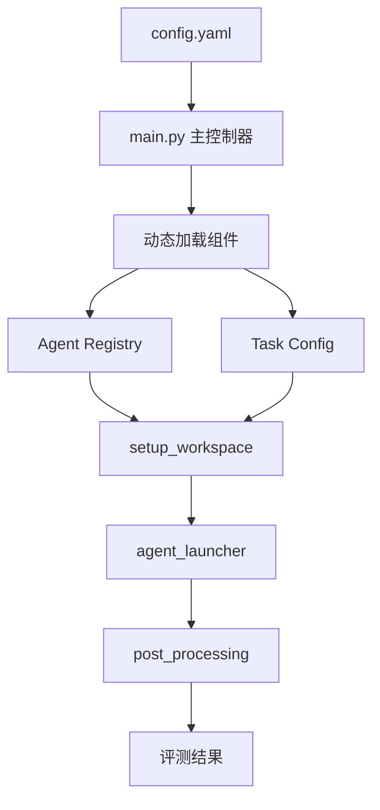

# Agent集成与执行流程

AIG-Eval框架的Agent集成与执行流程是其评测体系的核心执行引擎，负责协调配置管理、任务调度和Agent执行等多个组件的协同工作。通过精心设计的执行链路和灵活的Agent加载机制，框架能够高效地完成GPU kernel优化任务的自动化评测。

## 整体执行流程架构

AIG-Eval的执行流程采用清晰的分层架构，从配置读取到结果评测形成完整的闭环：



### 执行阶段详解

1. **配置初始化阶段** - 从config.yaml选择agent和任务
2. **组件加载阶段** - main.py作为主控制器，动态加载Agent Registry和Task Config
3. **工作区准备阶段** - setup_workspace复制任务到独立工作区
4. **Agent执行阶段** - agent_launcher调用Agent执行优化
5. **后处理阶段** - post_processing进行编译、正确性、性能测试和评分

## Prompt构造机制

AIG-Eval通过精心设计的Prompt构造机制，将任务信息传递给Agent。Prompt由6个关键部分拼接而成：

```python
prompt_sections = [
    # 1. Task Type Section      ← 任务类型描述
    # 2. Source Code Section    ← 要优化的文件
    # 3. Instructions Section   ← 编译/测试命令
    # 4. Output Format Section  ← 结果模板
    # 5. Cheatsheet Section     ← 优化技巧参考
    # 6. Workspace Info         ← 工作目录信息
]
final_prompt = "\n\n".join(prompt_sections)
```

[!tip] 这种结构化的Prompt设计确保Agent能够获得完整的任务上下文，包括目标、资源、约束和期望格式等信息。

### Prompt组成部分功能

1. **任务类型描述** - 提供任务背景和优化目标
2. **源代码信息** - 展示需要优化的具体代码
3. **指令集合** - 包含编译、测试等可用命令
4. **输出格式规范** - 定义结果输出的标准格式
5. **优化参考指南** - 提供相关的优化技巧和建议
6. **工作环境信息** - 说明文件系统结构和可用工具

## Agent加载与注册机制

AIG-Eval实现了灵活的Agent插件化架构，支持多种Agent类型的无缝集成。

### Agent注册流程

添加新Agent需要在agents/目录下创建新模块，实现launch_agent函数并使用@register_agent装饰器注册：

```python
@register_agent("swe_agent")
def launch_agent(...):
    AGENT = "mini"
    # Agent启动逻辑
    cmd = f"{AGENT} {OPTIONS} ..."
    subprocess.Popen(cmd, ...)
```

### Agent动态加载机制

Agent的加载过程体现了框架的高度灵活性：

1. **配置读取** - 从config.yaml读取agent.template字段获取Agent名称
2. **类型映射** - module_registration.py将字符串转换为AgentType枚举
3. **模块导入** - 根据枚举类型动态导入对应的启动器模块
4. **函数调用** - 调用@register_agent装饰器注册的launch_agent函数
5. **系统执行** - 通过系统PATH查找并执行对应的命令

[!warning] 框架不关心Agent的具体实现位置，只要求系统能够找到对应的命令。如mini-swe-agent中的"mini"命令需要在系统PATH中可用。

### 加载流程示例

以SWE-agent为例，完整的加载流程如下：

```yaml
# 第1步：config.yaml
agent:
  template: SWE-agent
```

```python
# 第2步：module_registration.py
class AgentType(Enum):
    SWE_AGENT = "swe_agent"

if agent_type == AgentType.SWE_AGENT:
    from agents.SWE_agent import launch_agent
```

```python
# 第3-4步：agents/SWE_agent/launch_agent.py
@register_agent("swe_agent")
def launch_agent(...):
    AGENT = "mini"  # 这是命令名，不是目录路径
    cmd = f"{AGENT} {OPTIONS} ..."
```

```bash
# 第5步：系统PATH执行
$ which mini
/home/user/projects/mini-swe-agent/bin/mini
```

## 不确定性处理策略

AI Agent的固有随机性是评测过程中的重要挑战。AIG-Eval通过多种策略应对这种不确定性：

### 不确定性来源
- **LLM生成随机性** - 相同prompt可能产生不同的优化策略
- **探索路径差异** - Agent可能尝试不同策略组合
- **迭代次数变化** - 不同运行可能需要不同次数的迭代

### 缓解措施
- **多次运行统计** - 同一配置运行多次获取统计指标
- **标准化评分** - 最终评分维度固定，确保可比性
- **成功稳定性** - 关注Agent的成功率和稳定性指标

## 执行环境隔离

为避免任务间的相互干扰，AIG-Eval实现了完善的工作区隔离机制：

- **独立工作目录** - 每个任务在独立的环境中执行
- **资源隔离** - 避免文件冲突和依赖干扰
- **状态清理** - 执行完成后自动清理临时状态

通过这种精心设计的Agent集成与执行流程，AIG-Eval为GPU kernel优化评测提供了一个稳定、可靠、可扩展的执行平台，真正实现了评测Agent自主解决问题能力的核心目标。