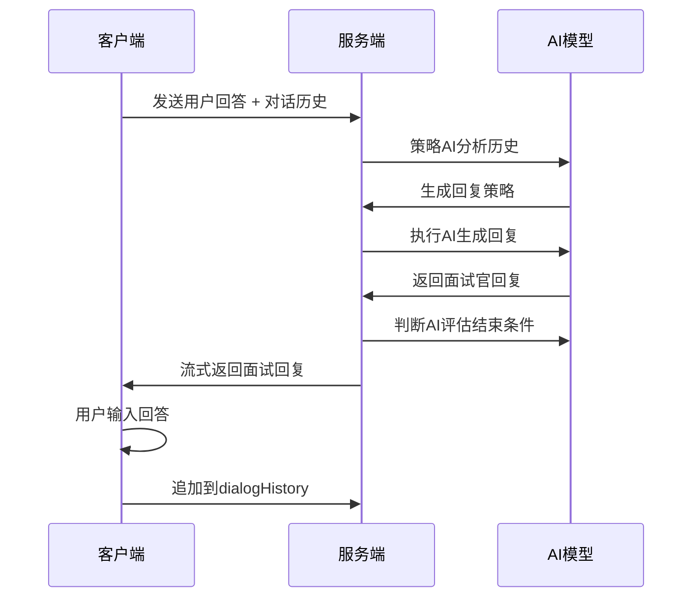

# AI面试与简历优化系统架构揭秘

## 系统概览：双核驱动的AI应用生态

在现代人力资源科技领域，AI面试与简历优化系统正在重新定义招聘流程。这类系统通过深度学习和大语言模型技术，为求职者和招聘方提供智能化、个性化的服务。系统核心包含两大功能模块：AI模拟面试和简历智能优化，两者相辅相成，构建了完整的求职准备生态系统。

> [!info]
> **系统架构特点**
> - 模块化设计：各功能独立解耦，便于维护和扩展
> - 流式响应：实时提供用户体验反馈
> - 异步处理：耗时操作后台执行，避免阻塞
- 多模态支持：文本、语音、视频全方位分析

## AI模拟面试系统：从对话到评估

### 核心接口功能解析

系统提供了三个核心接口来支持完整的面试流程：

1. **virturlInterview接口**：模拟实时面试对话
   - 以流式方式返回AI面试官的回复
   - 支持多轮对话交互
   - 根据面试类型动态调整策略

2. **interviewReport接口**：生成综合面试评估报告
   - 面试结束后异步生成详细分析
   - 包含多个维度的评估指标
   - 支持回调通知机制

3. **jdFillingGenerate接口**：生成虚拟岗位信息
   - 基于用户画像智能创建岗位描述
   - 提供个性化的面试场景
   - 生成虚拟公司信息以增强真实感

> [!warning]
> **重要提示**
> jdFillingGenerate接口生成的是虚拟岗位，AI会根据用户画像和期望职位自动构造公司与岗位描述，但这些岗位并不真实存在，主要用于面试练习场景。

### 白领与蓝领面试的差异化设计

系统针对不同岗位类型设计了差异化的面试策略：

#### 白领面试（interviewType=1）
- **双层AI架构**：策略AI + 执行AI
- **考察重点**：硬技能、软技能和文化适配性
- **处理流程**：策略AI分析 → 执行AI生成回复 → 判断AI评估结束条件

#### 蓝领面试（interviewType=0）
- **单层AI架构**：仅执行AI
- **考察重点**：年龄、身体状况和稳定性
- **处理流程**：执行AI直接生成回复 → 判断AI评估结束条件

### 多轮对话的实现机制

系统采用请求-响应模式实现多轮对话，每次接口调用代表面试官的一次回复：



> [!tip]
> **对话结束的智能判断**
> 系统通过第三个AI模型自动识别面试结束时机：
> - 输入：面试官的最新回复内容
> - 处理：语义分析而非简单字符串匹配
> - 输出：继续或结束的明确信号

## 简历优化系统：从基础润色到深度优化

### 双接口设计模式

简历优化功能通过两个互补的接口实现：

#### /resumeBasicOptimize接口
- **功能**：基础润色和优化
- **范围**：基本信息、工作经历、项目经历
- **特点**：一次性返回完整结果

#### /resumeDeepOptimize接口
- **功能**：深度优化和针对性改进
- **技术**：基于对话历史的个性化优化
- **特点**：流式分模块返回结果

> [!note]
> **接口本质相同**
> /chat和/resumeDeepOptimize两个接口底层调用相同的函数，逻辑一致。区别仅在于：
> - /chat提供流式响应，适合实时交互
> - /resumeDeepOptimize一次性返回，适合后台处理

### 深度优化的流式响应机制

考虑到简历优化耗时较长（可能超过20秒），系统采用模块化流式响应：

```python
# 流式响应示例
response_stream = [
    {"type": "heartbeat", "content": "正在处理基本信息..."},
    {"type": "basic", "content": "基本信息优化结果"},
    {"type": "work", "content": "工作经历优化结果"},
    {"type": "project", "content": "项目经历优化结果"},
    {"type": "DONE", "content": "[DONE]"}
]
```

> [!success]
> **流式响应的用户体验价值**
> - 即时反馈：用户可实时看到处理进度
> - 降低焦虑：避免长时间等待的不确定性
- 增强信任：透明的处理过程提升用户信心

### 对话式优化流程

系统通过两个接口实现对话式简历优化：

1. **/resume/deep-optimization/converse**：多轮对话接口
   - 首次请求返回优化计划（plan字段）
   - 后续请求必须携带plan字段
   - over信号表示对话可结束

2. **/resume/deep-optimization/generate**：生成最终简历
   - 基于对话历史生成优化简历
   - 在收到over信号后调用

> [!question]
> **流程控制逻辑**
> ```
> 首次请求 → 获取plan → 多轮对话 → 检测over信号 → 调用generate接口 → 生成最终简历
> ```

## 系统架构的核心技术

### 意图分类的LLM方案

传统意图分类需要训练专门的模型（如BERT、TextCNN），依赖大量标注数据。而本系统采用LLM零样本方案：

```python
# 意图分类提示词示例
intent_prompt = """
请分析用户意图，从以下三个选项中选择一个：
1. resume_optimize - 简历优化
2. generate_job - 生成岗位
3. chat - 普通对话

只输出JSON格式：{"intent": "选择结果"}
"""
```

### 异步任务处理机制

对于耗时操作（如面试报告生成），系统采用后台异步处理：

```python
# FastAPI后台任务示例
@app.post("/interviewReport")
async def generate_report(data: InterviewData):
    # 立即入库，content为空
    report_id = database.insert_report(data)

    # 启动后台任务
    background_task.add_task(
        generate_report_background,
        report_id,
        data.dialog_history
    )

    return {"message": "success", "report_id": report_id}
```

> [!info]
> **后台任务的处理流程**
> 1. 客户端发送请求
> 2. 立即返回成功响应
> 3. 后台任务开始处理
> 4. 多次调用AI分析各维度
> 5. 生成后更新数据库
    6. 回调通知外部系统

### Redis在系统中的应用

Redis作为高性能缓存系统，在多个场景中发挥关键作用：

- **会话管理**：存储用户对话状态和上下文
- **临时数据**：缓存处理过程中的中间结果
- **限流控制**：实现API调用频率限制

```bash
# Redis操作示例
# 设置键值对（带过期时间）
SET session:user123 "dialog_context" EX 3600

# 获取值
GET session:user123

# 删除键
DEL session:user123
```

## 报告生成系统的多维分析

面试报告生成系统提供两个版本的分析报告：

### HR报告（内部使用）
包含以下分析维度：
- 整体评估：综合评分和结论
- 详细分析：逐项评分和说明
- 能力模型：岗位匹配度分析
- 岗位匹配：具体技能对比
- 性格分析：行为特质评估
- 薪资分析：市场价值评估
- 风格报告：沟通风格分析

### 候选人报告（面向求职者）
提供友好的改进建议和职业指导。

> [!warning]
> **报告生成特点**
> final_report不是一次性生成的，而是通过模型多次调用生成各个子字段后，再汇总注入到final_report中。

## 系统性能与用户体验优化

### 流式传输的三种数据类型

系统流式响应中包含三种类型的数据：

1. **heartbeat**：心跳信号，表示服务存活状态
2. **chunk**：实际内容片段，如AI生成的文本
3. **DONE**：结束标记，表示流式传输完成

```python
# 流式响应的结束标记
final_chunk = {
    "type": "DONE",
    "content": "[DONE]"
}
```

### 前端处理建议

对于流式响应，前端应该：

1. **监听over信号**：在对话接口中检测结束信号
2. **显示进度提示**：让用户了解处理状态
3. **分块处理内容**：实时更新界面显示
4. **错误处理机制**：处理连接中断等异常情况

## 总结

AI面试与简历优化系统代表了人力资源科技的前沿应用。通过精心设计的架构、智能化的算法和用户友好的交互，这类系统正在帮助求职者提升面试表现，优化简历质量，最终实现更好的职业发展。

系统的成功关键在于：
- **技术架构的合理设计**：模块化、可扩展、高性能
- **用户体验的深度优化**：实时反馈、流程透明、操作简便
- **AI能力的有效应用**：个性化、智能化、专业化

未来，随着大语言模型技术的持续发展，这类系统将变得更加智能和实用，为求职者和招聘方创造更大的价值。

---

相关阅读：
- [[外包项目管理全流程实战指南]]
- [[FastAPI开发从入门到进阶]]