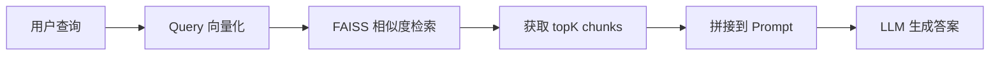

# RAG 从入门到评估：chunk、topK 与 RAGAS

## 一、RAG 系统的本质理解

RAG（Retrieval-Augmented Generation）不是一个单纯的模型问题，而是**两个系统的叠加**：

```
[ Retrieval System ]  →  [ Generation System ]
     检索系统              生成系统
```

> [!info]
> **RAG = 检索 + 生成**
> - 仅检索（embedding + FAISS 返回文本）≠ RAG
> - 仅生成（LLM 直接回答）≠ RAG
> - RAG 必须包含**检索**和**基于检索结果的生成**两个环节

## 二、核心概念辨析：Entry vs Chunk

理解 RAG 的第一步，是分清两个容易混淆的概念。

### 2.1 定义区别

| 概念 | 定义 | 类比 |
|------|------|------|
| **Entry** | 文档级/来源级的"原子记录" | 一本书（书名、作者、ISBN、来源链接） |
| **Chunk** | 从 entry 正文切分的小片段 | 书里的第 3 章第 2 节（200~500 tokens） |

> [!note]
> **Entry 包含的信息**
> - 来源标识
> - 整体内容
> - 元数据（作者、时间、权限等）

**Chunk 包含的信息**
- entry 的部分文本内容
- 用于 embedding 和检索
- 用于拼接到 LLM 上下文

### 2.2 Chunk 的本质

> [!warning]
> **Chunk ≠ 天然的"段落"或"2-3 句"**

Chunk 的本质是：**为检索与拼上下文而人为切出来的"可控文本块"**。

它怎么切，完全由你的 **chunking 策略**（代码/配置）决定，而非文档的自然结构。

### 2.3 Chunk 切分与质量

```
chunk 切分 → 由 chunker（代码）决定
chunk 质量 → 由 chunker + embedding 模型共同决定
```

一个好的 chunk 需要同时满足：
- 切分策略合理（语义完整、边界合理）
- embedding 模型能有效编码其语义

## 三、Naive RAG 基础流程

### 3.1 标准流程

Naive RAG（基础版 RAG）是最简单直接的实现方式：



> [!tip]
> **Naive RAG 四步法**
> 1. Query embedding：将查询转换为向量
> 2. 向量检索 topK：在 FAISS 中搜索最相似的 chunk
> 3. 拼接上下文：将检索结果拼入 prompt
> 4. LLM 生成：调用大模型生成最终答案

### 3.2 实际 RAG 的增强操作

在真实 RAG 系统中，除了基础流程外，通常还会包含三种增强操作：

> [!info]
> **检索增强三剑客**
> - **Query Rewrite**：重写查询以优化检索效果
> - **Query Expansion**：扩展查询，增加同义词、相关词
> - **拆子问题**：将复杂查询拆解为多个子问题分别检索

## 四、检索后处理

检索到 topK chunks 后，直接喂给 LLM 并不是最优策略。常见的后处理流程包括：

> [!note]
> **检索后处理三步骤**
> 1. **去重**：移除重复的 chunk
> 2. **聚合**：按文档或主题聚合相关 chunks
> 3. **排序**：重新排序以优化相关性

### 4.1 多样化检索策略

一个实际问题：top5 chunks 可能来自同一个文档的 5 个相邻 chunk，但你更想要来自不同文档的 3-5 个内容。

> [!success]
> **推荐策略：按 entry 去重**
> ```
> 1. 执行 topK chunk 检索
> 2. 按 entry_id 去重
> 3. 每个 entry 最多保留 2 个 chunk
> ```

这对小文档库的效果提升非常明显。

## 五、关键参数调优

### 5.1 Chunk Size 选择

在不限定具体 embedding 模型的情况下，通用经验值是：

| 参数 | 推荐值 | 说明 |
|------|--------|------|
| **Chunk Size** | 200-500 tokens | 用于向量检索的文本块大小 |
| **Overlap** | 20% (50-100 tokens) | 相邻 chunk 的重叠长度 |

> [!tip]
> **为什么使用 token 而非字符？**

因为 **embedding 模型"理解"的是 token，不是字符**：

```
文本 → tokenizer → tokens → embedding 向量
```

在英文中，1 token ≈ 4 个字符。chunk_size = 400 tokens 约对应 **1500-1700 个英文字符**。

### 5.2 Chunk Size 是否太大？

400 tokens（约 1600 字符）会不会太大？答案是否定的。

> [!info]
> **400 tokens 是业界的保守选择**

人类按"段落长度"阅读：1500 字符 ≈ 2-3 个段落

但 embedding 模型关心的是：
- 语义是否完整
- 信息是否足够密集
- 能否稳定表示一个"知识单元"

**1600 字符** 在**语义完整性**和**检索精度**之间是一个合理的折中点。

### 5.3 Overlap 的唯一作用

Overlap（重叠）的作用只有一个：

> [!warning]
> **防止关键信息刚好被切在 chunk 边界**

没有 overlap，一个完整的概念可能被强行切断，导致检索时丢失上下文。

### 5.4 TopK 选择策略

TopK 不是越大越好，而是在 **Recall（召回率）** 和 **噪声** 之间做 trade-off：

```
topK 越大 → Recall 越高，但噪声越多
topK 越小 → 噪声越少，但可能遗漏相关内容
```

> [!tip]
> **100 文档规模的黄金点：top5**

在 100 文档规模下，**top5** 是推荐值：
- Recall 基本拉满
- 噪声还可控
- Prompt 不会爆炸

## 六、检索评估体系

### 6.1 评估原则

> [!danger]
> **不要一开始就用"最终答案好不好"来评估**

应该先评估**检索部分**：即「该不该被检索出来的内容，有没有被检索出来？」

只有检索做好了，生成才有意义。

### 6.2 Recall@K 指标

Recall@K 的含义是：**理应出现的内容，有没有出现在 topK 里**。

> [!info]
> **Recall@K 计算示例**
> - 你认为 doc_12 一定要被检索到
> - top5 里出现了 doc_12
> - 那么 Recall@5 = 1

### 6.3 工程化参数选择

如何选择最佳的 chunk_size 和 topK 组合？推荐通过**网格搜索**方式：

```python
# 参数搜索伪代码
准备 30 条 query + 期望文档
固定 embedding 模型

for chunk_size in [200, 300, 500, 800]:
    for topK in [3, 5, 10]:
        跑 Retrieval
        算 Recall@K

选择 Recall 最稳的组合
```

### 6.4 Embedding 质量 vs FAISS 参数

> [!success]
> **Embedding 质量 ≫ FAISS 参数**

```
好 embedding + 简单索引 > 坏 embedding + 复杂索引
```

建议：
- 不要一开始纠结 FAISS IVF/HNSW 等参数
- 先选一个靠谱的 embedding 模型
- 优化 embedding 效果比调整 FAISS 参数收益更大

## 七、评估集构建

### 7.1 RAG 工程最大痛点

构建高质量的检索评估集（QA 对 / query-document 对）是 RAG 工程中最耗时的工作。

> [!warning]
> **人工构造评估集需要回答两个问题**
> 1. 这个 query 期望哪些文档 / chunks 被检索到？
> 2. 哪些 doc 是"不相关的"？

### 7.2 LLM 辅助标注

借助 LLM 可以自动标注 80% 的数据：

> [!tip]
> **LLM 辅助评估集构建**
> ```
> 1. 给 LLM 一个 chunk pool
> 2. 输入 query，让 LLM 生成"应该检索哪些 chunk"
> 3. 只对模型预测结果做人工审核/修正
> ```

伪示例 Prompt：

```python
你是一个专家搜索引擎评估助手：

给定一个用户 query 和一批候选 chunk
请从中挑出 1~3 个最相关的 chunk_id

返回 JSON：
{
  "query": "...",
  "relevant": ["id1", "id7"],
  "reason": "..."
}
```

## 八、RAGAS 评估框架

### 8.1 框架介绍

RAGAS（Retrieval-Augmented Generation Assessment System）是专门用于评估 RAG 系统的框架。

> [!info]
> **RAGAS 的本质：LLM-as-a-Judge**

使用 LLM 来评估 RAG 系统的检索与生成质量。

### 8.2 人工标注需求

使用 RAGAS ≠ 完全不需要人工标注

> [!note]
> **RAGAS 可以将人工标注量降低 70%-90%**

但并非完全零标注，仍需一定量的人工数据作为基准。

### 8.3 最佳使用场景

> [!success]
> **RAGAS 最适合的场景**
> - 比较不同 chunk size
> - 比较不同 topK
> - 比较不同 embedding model
> - 做相对优化（A vs B）

当目标是**配置对比和迭代优化**时，RAGAS 几乎不需要人工标注，非常好用。

### 8.4 无标注评估能力

RAGAS 可以在不标注标准答案的情况下，自动评估 RAG 系统的检索与生成质量，非常适合做：

- 快速迭代
- 配置对比
- 性能回归测试

## 九、总结

构建一个高质量的 RAG 系统，关键不在于复杂的技术栈，而在于：

> [!tip]
> **RAG 系统的三大核心**
> 1. **理解基础概念**：Entry vs Chunk，检索 vs 生成
> 2. **调优关键参数**：Chunk Size、Overlap、TopK
> 3. **建立评估体系**：Recall@K、评估集、RAGAS

记住：**Embedding 质量远比 FAISS 参数重要**，**检索评估优先于生成评估**。
