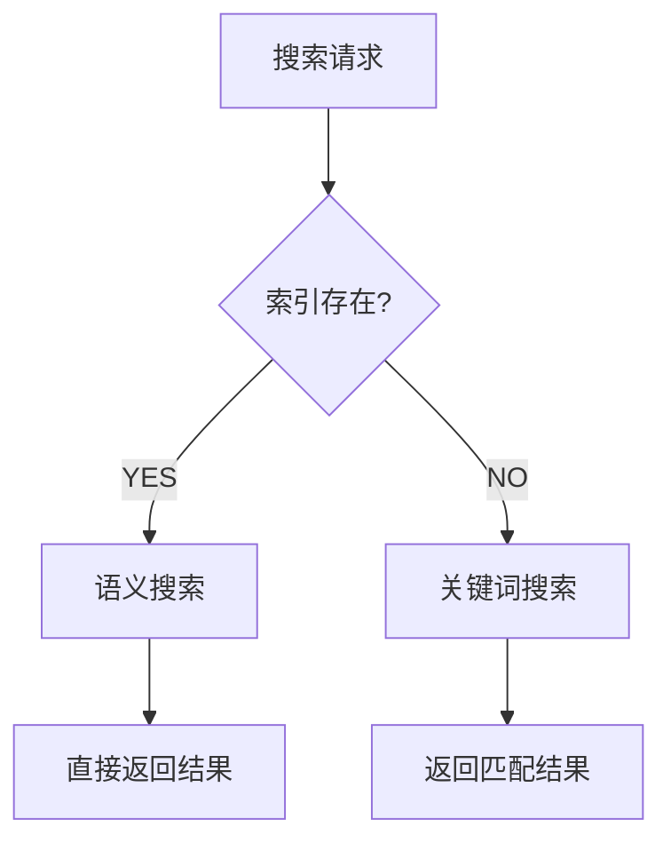

# ai-devtool MCP Server 与语义搜索实战笔记

## 一、搜索机制概述

ai-devtool MCP Server 提供了两套搜索机制：**关键词搜索**和**语义搜索**。两者可以独立运行，系统会根据索引是否存在自动选择使用哪种方式。

> [!info]
> **搜索模式选择逻辑**
> - 索引存在 → 使用语义搜索
> - 索引不存在 → 回退到关键词搜索
> - 语义搜索不是默认启用的，需要预先构建索引

## 二、关键词搜索原理

关键词搜索采用传统的分词匹配方式，其核心逻辑是：

> [!note]
> **关键词匹配优先级**
> 1. 标题匹配（权重最高）
> 2. 标签匹配
> 3. 内容匹配

系统会对查询进行分词，然后逐词匹配知识库中的内容，最终按照匹配分数排序返回结果。这种方式不需要预先构建索引，可以直接使用。

## 三、语义搜索原理

语义搜索基于[[向量相似度]]进行检索，使用 FAISS 向量库作为底层存储。完整的语义搜索流程包含三个步骤：


> [!tip]
> **语义搜索的本质**
> - 将查询文本转换为向量表示
> - 在向量空间中查找最相似的文本块
> - 优势在于相关性判断更精准，而非返回更短的内容

### 3.1 FAISS 向量库

ai-devtool 使用 FAISS 作为向量存储和检索引擎。FAISS（Facebook AI Similarity Search）是专门为高效向量相似度搜索设计的库。

## 四、索引构建与管理

### 4.1 索引存储位置

当执行索引构建后，所有索引文件会存储在 `~/.cache/amd-ai-devtool/semantic-index/` 目录下：

```bash
# 检查索引是否已构建
ls -la ~/.cache/amd-ai-devtool/semantic-index/
```

该目录包含两个核心文件：

> [!info]
> **索引文件结构**
> - `index.faiss` — FAISS 向量索引文件
> - `metadata.json` — 索引元数据

### 4.2 索引更新策略

> [!warning]
> **知识库更新后必须重建索引**

索引是知识库的**静态快照**，不会自动追踪知识库的变化。一旦知识库内容发生变更（新增、修改、删除文档），需要重新运行以下命令：

```bash
amd-ai-devtool maintenance build-index
```

### 4.3 检查索引状态

判断索引是否已构建，最直接的方式是检查索引目录是否存在：

```bash
# 简单检查索引是否存在
test -d ~/.cache/amd-ai-devtool/semantic-index/ && echo "索引存在" || echo "索引不存在"
```

## 五、与 mini-swe-agent 的集成

### 5.1 直接调用的兼容性

如果 mini-swe-agent 直接调用 ai-devtool MCP Server 的工具函数，但没有执行索引构建指令，功能是否可以正常使用？

> [!success]
> **完全可以正常运行**

系统设计了优雅的降级机制：
- 有索引时，自动使用语义搜索
- 无索引时，自动回退到关键词搜索

这种"即插即用"的设计确保了在任何情况下都能获得搜索结果。

### 5.2 首次自动构建方案

为了优化用户体验，可以实现在 mini-swe-agent 中集成"首次自动构建 + 后续跳过"的智能方案：

> [!tip]
> **自动索引构建流程**
> ```mermaid
> graph TD
>     A[mini --mcp 启动] --> B{索引存在?}
>     B -->|是| C[直接加载索引]
>     B -->|否| D[提示用户]
>     D --> E[subprocess 执行构建]
>     E --> F[缓存到本地]
>     F --> G[启用语义搜索]
> ```

具体实现时机是在 `MCPEnabledEnvironment` 初始化阶段：

> [!info]
> **实现伪代码**
> ```python
> # mini-swe-agent 启动时 (mini --mcp)
> MCPEnabledEnvironment 初始化:
>     if amd-ai-devtool 语义索引 不存在:
>         subprocess.run("amd-ai-devtool maintenance build-index")
>     else:
>         正常初始化，MCP 工具自动使用语义搜索
> ```

### 5.3 启用 MCP 调试模式

在使用 mini-swe-agent 时，如果想启用 MCP 并查看调试信息：

```bash
mini --mcp -d
```

## 六、搜索模式选择与对比

### 6.1 搜索模式切换逻辑

系统不会同时使用两种搜索方式，而是采用明确的判断逻辑：



### 6.2 语义搜索 vs 关键词搜索

| 维度 | 关键词搜索 | 语义搜索 |
|------|-----------|---------|
| 原理 | 分词 + 匹配 | 向量相似度 |
| 索引 | 无需构建 | 需要 FAISS 索引 |
| 准确性 | 依赖精确匹配 | 理解语义意图 |
| 返回长度 | 完整 entry | 完整 entry |

> [!question]
> **语义检索返回的内容更短吗？**

不一定。两种搜索方式最终都返回**完整的 entry 内容**，而不是 chunk。语义搜索的优势在于相关性判断更精准，而非内容更精炼。

## 七、返回长度优化

### 7.1 返回过长的根源

ai-devtool MCP Server 返回内容过长的根本原因是：**系统返回的是 entry 级别的内容，而不是 chunk 级别**。

当每条 entry 本身内容较多时，即使只返回几条，总长度也会相当可观。这与[[RAG技术]]中的 chunk 概念密切相关——entry 是文档级原子记录，chunk 才是检索用的文本片段。

> [!tip]
> **优化方向**
> 如果需要控制返回长度，可以考虑：
> - 限制返回的 entry 数量
> - 对 entry 内容进行摘要处理
> - 在构建索引时控制单个 entry 的大小
